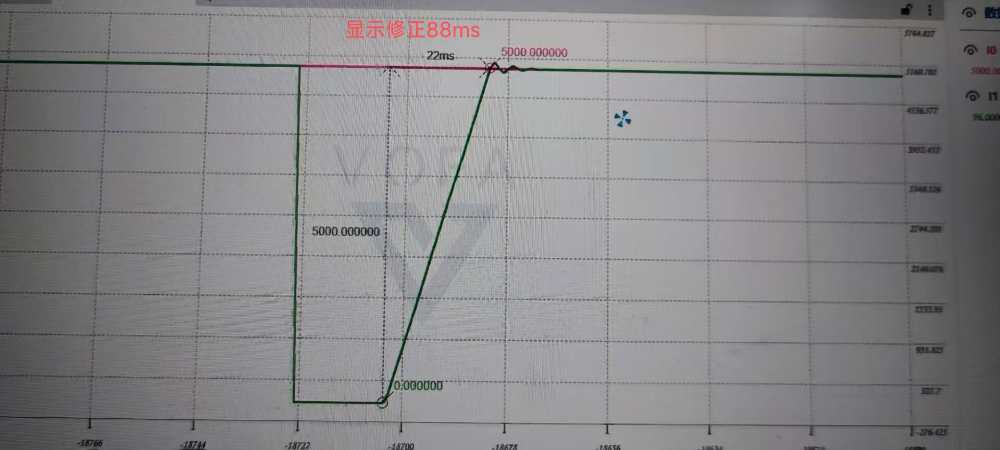
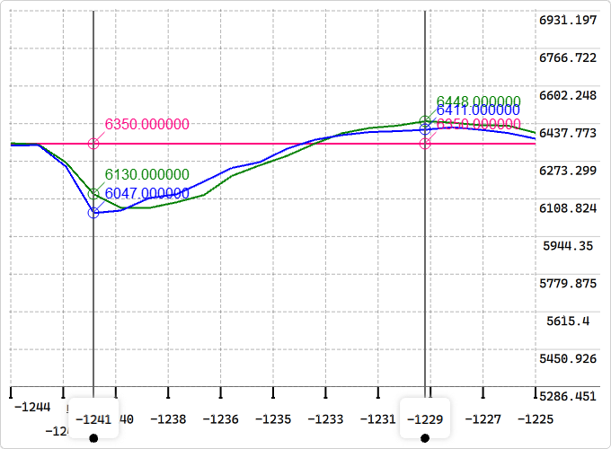
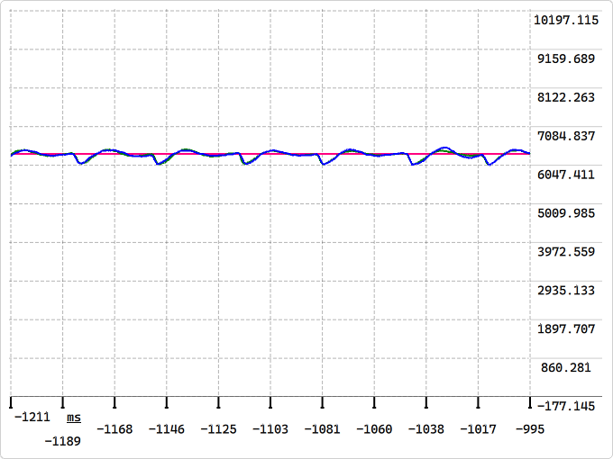

# 【RM2025-云台各部件滑模控制器开源】四川大学-火锅战队

    

## 开源内容(仿真及代码)
附开源链接：https://github.com/GreenHand314/Sliding.git
### 位置控制器(需两个反馈值)
- EXPONENT -> 线性关系滑模面， 指数趋近率 -> 适用于Yaw(推荐)
- POWER -> 线性关系滑模面， 幂次趋近率 -> 适用于Yaw(较推荐)
- EISMC -> 比例积分关系滑模面， 指数趋近率 -> 适用于Pitch，拨弹轮
- TFSMC -> 快速终端滑模控制 -> 适用于Yaw(较不推荐)

### 速度控制器(仅一个反馈值)
- VELSMC -> 比例积分关系滑模面， 指数趋近率 -> 适用于摩擦轮、底盘电机等速度控制场景

## 优势
- **强抗干扰能力：** 系统达到滑模面后，对匹配干扰完全鲁棒。举例：即在电机力矩承受范围内，云台上供弹条件下，相同参数在不同承载弹丸量时能保证控制效果基本一致且良好。
- **时变扰动抑制：** 对“连续性”较强和“离散性”较强的信号具有较高的包容性。举例：面对遥控更新频率较高的信号和自瞄小电脑传输的断续且频率波动的信号可使用同一套参数及模型。
- **不连续控制率：** 即使部分控制信号丢失，滑模面的稳定性仍可维持。举例：若电机无法快速跟踪其输出，仍可保证控制效果稳定。
- **参数鲁棒性：** 可通过切换控制律直接抵消干扰影响，不依赖精确参数，且参数较少，上手较快。举例：即同一组参数可适配不同结构机器且控制效果一致，以及仅在粗调后可达到较好控制效果。

## 开发过程
2024年3月13日滑模控制器位置控制仿真成功，14日实现GM6020电机空载实物测试，次日凌晨Yaw轴控制实机测试成功；4月14日滑模控制器速度控制仿真成功，并完成摩擦轮实机测试；4月28日滑模控制器Pitch位置控制仿真，并实现实机测试，5月23日发现切换参数时会导致Pitch输出跳变，故增加控制输出连续化处理，并添加积分项清理接口，以防止死亡后积分持续累积而导致的Pitch卡死及摩擦轮过速致超射速等问题，至此云台全部结构均可使用滑模控制。经24-25两赛季不同结构机器检验，本套控制算法趋于成熟。

## 使用说明
### 仿真 
采用matlab(版本R2024a)-simulink工具箱
### 代码：
**主体：** 构造cSMC类，链表Rmode选择控制器类型

**自定义变量：** 详细含义请见代码注释
- RError -> 误差存储部分变量
- SlidingParam -> 参数存储部分变量
- Sliding -> 控制器变量集合

**接口函数说明：** 
- Init() -> 初始化
- SetParam(...) -> 参数设置
- ErrorUpdate(...) -> 误差更新
- SmcCalculate(...) -> 控制器计算函数
- Clear() -> 控制器计算中间值全清空
- Integval_Clear() -> 积分部分误差清空
- Out() -> 获取控制器输出
- SetOut(...) -> 控制器输出设定(调试用)
- &getSmc() -> 控制器参数全获取(调试用)

**私有函数说明：** 
- OutContinuation() -> 切换参数时输出连续化，防止因积分系数突变时导致控制器输出突变
- Signal(...) -> 符号函数，用于控制器内部计算
- Sat(...) -> 饱和函数，用于控制器内部计算

## 控制效果(演示视频若无法显示请见other文件夹中)
### GM6020空载粗调参数控制效果
<video width="720" height="360" controls>
  <source src="other/video_1.mp4" type="video/mp4">
  Your browser does not support the video tag.
</video>

    

### 上赛季“牢兵”云台yaw控制效果
<video width="360" height="720" controls>
  <source src="other/video_2.mp4" type="video/mp4">
  Your browser does not support the video tag.
</video>

### 本赛季“新兵”云台pitch控制效果
<video width="360" height="720" controls>
  <source src="other/video_3.mp4" type="video/mp4">
  Your browser does not support the video tag.
</video>

### 本赛季“新兵”云台摩擦轮控制效果

    
    

## 设计过程、调参经验及其他信息请见 Documentation 内详细文档

## 参考文献：
滑模变结构控制MATLAB仿真_先进控制系统设计方法 (第3版)_刘金琨著 _2015.12  
滑模变结构控制SMC(一)——滑模变结构控制的设计步骤 - 昔时扬尘处的文章 - CSDN
https://blog.csdn.net/qq_42249050/article/details/107224303  
非线性系统（十三）滑模控制解析 - Chenglin Li的文章 - 知乎
https://zhuanlan.zhihu.com/p/138860110  
滑模控制器最强解析 - Y-box的文章 - 知乎
https://zhuanlan.zhihu.com/p/78549442  
滑模变结构控制 - HuangTL的文章 - 知乎
https://zhuanlan.zhihu.com/p/386592978  
现代控制理论—非线性鲁棒控制器_sliding mode_滑模控制 - 纯狐的文章 - 知乎
https://zhuanlan.zhihu.com/p/657512536  
非线性系统（十三）滑模控制解析 - Chenglin Li的文章 - 知乎
https://zhuanlan.zhihu.com/p/138860110  
永磁同步电机控制算法--改进指数趋近律滑模速度控制器 - Neil motor的文章 - CSDN 
https://blog.csdn.net/m0_45796409/article/details/144173934?  
滑模控制的一种简单理解 - 半年这么快过去了的文章 - 知乎 
https://www.zhihu.com/tardis/zm/art/463230163?source_id=1005  

